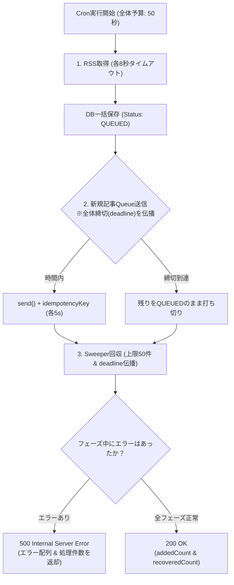

# 実装計画書: Vercel Cron (`/api/cron/fetch-news`) タイムアウト・5XXエラー恒久対策

## 1. 概要と背景

### 1.1 問題の事象
本番環境の Vercel Cron Job (`/api/cron/fetch-news`) において、実行ステータスが **5XX (エラー率 100%)** となり、失敗が記録される事象が発生しました。

### 1.2 Observability（監視ログ）の分析結果
- **Active CPU / 実行時間**: `2m` (120秒)
  - Vercel Fluid Compute / Serverless Function のプラットフォーム強制終了上限（120秒）に達している。
- **Memory Usage**: `2.05 GB / 2.05 GB`
  - タイムアウトによるプロセス強制終了（`FUNCTION_INVOCATION_TIMEOUT`）に伴い、割り当てメモリ上限が記録されている。
- **外部 API 呼び出しの記録**:
  - `hnd1.vercel-queue.com`: 74回
  - 各種 RSS ソース（Google, NHK, ライブドア, はてな, 厚労省, AstroArts, グルメプレス等）: 計32回
- **後続処理（`/api/queue/fetch-image`）の状況**:
  - 呼び出し回数: 59回
  - Active CPU: 平均 2.6秒
  - エラー率: **0%（正常稼働）**

### 1.3 診断の結論
RSSの取得、DB保存、Vercel Queues への投入処理自体は実行され、Queue Consumer 側も正常に画像取得を処理できています。  
しかし、**Cron の Route Handler がレスポンスを返却する前に外部通信の遅延等で制限時間を超過し、Vercel プラットフォームにより強制終了された** ことが直接の原因です。

---

## 2. 根本原因の詳細分析（Codex レビュー最新反映版）

### 2.1 RSS 取得処理におけるタイムアウトの欠如 (`lib/news.ts`)
- `fetchRssFeeds()` 内の `fetch(source.url, fetchOptions)` にタイムアウトが設定されていませんでした。
- 登録されている 32 件の外部 RSS フィードのうち、1 件でもレスポンスが遅延（ハング）または TCP 接続が保留されると、Node.js の `fetch` は長時間待機し続け、`Promise.allSettled` 全体がブロックされます。

### 2.2 Queue 送信におけるタイムアウト・個別ハング (`lib/queue.ts`)
- `enqueueImageFetch` 内でチャンク分割を行っていても、`Promise.allSettled` はチャンク内の全 Promise が確定するまで待ち続けます。
- チャンク内の 1 件でも `send()` がネットワーク障害で応答待ちになると、後続チャンクが一切開始されず、Vercel Function の実行時間（60秒）上限までハングします。

### 2.3 新規記事の Queue 送信における全体締切（`deadline`）の未伝播バグ (`lib/news.ts`) 【P1】
- `syncNews()` で全体締切 `deadline = Date.now() + 50000` を計算しているものの、`saveNewsToDb(newItems)` 呼び出し時に `enqueueOptions` が渡されていませんでした。
- その結果、新規記事の Queue 投入時には `enqueueImageFetch` の締切制御が働かず、大量記事（例: 100〜200件）取得時に 50 秒を超えて送信を続け、Vercel の 60 秒プラットフォーム制限で強制終了してしまいます。

### 2.4 RSS 取得全件失敗時における孤立キュー回収 Sweeper のスキップバグ (`lib/news.ts`) 【P1】
- `syncNews()` 内で `if (latestItems.length === 0) return { count: 0 }` という早期 return が存在しました。
- RSS ソースが障害やタイムアウトで全件失敗して `latestItems` が空配列になった場合、後続の `recoverOrphanedQueuedItems()` に到達しませんでした。

### 2.5 エラーを握りつぶして 200 OK を返却するサイレント障害バグ (`lib/news.ts`, `app/api/cron/fetch-news/route.ts`) 【P1〜P2】
- `syncNews()` 内で RSS/DB 保存フェーズや Sweeper フェーズのエラーを `try-catch` でログ出力するのみで握りつぶし、常に通常オブジェクトを返却していました。
- これにより、DB 接続断、トランザクション失敗、DB クエリ例外などの致命的障害時でも Route Handler が `status: 200` (`success: true`) を返し、監視上は Cron 成功に見えてデータ保存が失敗している深刻なサイレント障害を引き起こします。

---

## 3. 改修設計と対策方針



| 項目 | 対策内容 | 期待効果 |
| :--- | :--- | :--- |
| **RSS Fetch タイムアウト** | `fetch(source.url, { signal: AbortSignal.timeout(8000) })` を導入 | 遅延・停止している外部フィードを最大 8 秒で確実に切り離し、Cron 全体の待機を防止 |
| **Queue 個別送信タイムアウト** | `sendWithTimeout(send(...), 5000)` により各 `send()` を最大 5 秒に制限 | 1 件の送信ハングによるチャンク停止・Function 全体ハングを防止 |
| **Queue 冪等性キー付与** | `idempotencyKey: `image-fetch-${item.id}`` を指定 | タイムアウト後に裏で Queue 受理されていた場合の二重処理を Vercel Queue 側で自動重複排除 |
| **新規記事への全体締切伝播** | `saveNewsToDb(newItems, { enqueueOptions: { deadline } })` を渡す | 新規記事・Sweeper の両方で 50 秒予算を守り、60 秒強制終了を確実に回避 |
| **Sweeper 常時実行化** | `syncNews` で RSS の結果に関わらず `recoverOrphanedQueuedItems` を必ず実行 | RSS 全件障害時でも孤立キュー回収が継続稼働する |
| **エラー情報の集約と 500 返却** | `syncNews` が `errors: string[]` を集約し、エラー時は Route Handler が 500 を返却 | DB 障害等のサイレント失敗を防止し、Vercel Observability で正しく検知 |
| **リカバリ件数の制限** | `recoverOrphanedQueuedItems` に `take: 50` の上限を追加 | 1 回の Cron 実行におけるリカバリ処理負荷を一定範囲に抑制 |
| **maxDuration の明示** | `app/api/cron/fetch-news/route.ts` に `export const maxDuration = 60;` を追加 | Vercel Serverless Function の実行許容時間を確実に 60 秒に設定 |

---

## 4. 各モジュールの具体的な改修仕様

### 4.1 `lib/queue.ts`

```typescript
import { send } from '@vercel/queue';

const QUEUE_DELAY_INTERVAL_SECONDS = 2;
const DEFAULT_SEND_TIMEOUT_MS = 5000; // 1送信あたり最大5秒

export interface EnqueueResult {
  successCount: number;
  failureCount: number;
  failedIds: string[];
}

export interface EnqueueOptions {
  timeoutMs?: number;
  deadline?: number; // Date.now() + 残り予算ミリ秒
}

/**
 * Promiseにタイムアウトを設定するラッパー
 */
async function sendWithTimeout<T>(
  promise: Promise<T>,
  timeoutMs: number,
  errorMessage = 'Queue send timed out'
): Promise<T> {
  let timer: NodeJS.Timeout;
  const timeoutPromise = new Promise<never>((_, reject) => {
    timer = setTimeout(() => {
      const err = new Error(errorMessage);
      err.name = 'TimeoutError';
      reject(err);
    }, timeoutMs);
  });

  try {
    return await Promise.race([promise, timeoutPromise]);
  } finally {
    clearTimeout(timer!);
  }
}

export function calculateQueueDelay(index: number, _domain: string): number {
  return index * QUEUE_DELAY_INTERVAL_SECONDS;
}

export async function enqueueImageFetch(
  newsItems: { id: string; link: string }[],
  options: EnqueueOptions = {}
): Promise<EnqueueResult> {
  if (newsItems.length === 0) {
    return { successCount: 0, failureCount: 0, failedIds: [] };
  }

  const { timeoutMs = DEFAULT_SEND_TIMEOUT_MS, deadline } = options;
  const CHUNK_SIZE = 10;
  const allResults: Array<PromiseSettledResult<{ id: string; success: boolean }>> = [];

  for (let i = 0; i < newsItems.length; i += CHUNK_SIZE) {
    // 全体締切（予算）をチェック: 残り時間が少なければ後続チャンクを中断
    if (deadline && Date.now() >= deadline) {
      console.warn(`[Queue Enqueue] Deadline reached at chunk starting index ${i}. Remaining items left in QUEUED state.`);
      // 残り全件を失敗（スキップ）として記録
      for (let j = i; j < newsItems.length; j++) {
        allResults.push({
          status: 'rejected',
          reason: new Error('Execution deadline exceeded; remaining items left for sweeper'),
        });
      }
      break;
    }

    const chunk = newsItems.slice(i, i + CHUNK_SIZE);
    const chunkResults = await Promise.allSettled(
      chunk.map(async (item, chunkIndex) => {
        const globalIndex = i + chunkIndex;
        let domain = 'unknown';
        try {
          domain = new URL(item.link).hostname;
        } catch {
          // 不正URLはデフォルト値のまま
        }

        const delaySeconds = calculateQueueDelay(globalIndex, domain);

        // タイムアウト付きで send 実行 & idempotencyKey を付与
        await sendWithTimeout(
          send(
            'image-fetch',
            {
              newsItemId: item.id,
              link: item.link,
            },
            {
              delaySeconds,
              idempotencyKey: `image-fetch-${item.id}`,
            }
          ),
          timeoutMs,
          `Send timed out for item ${item.id}`
        );

        console.log(`Enqueued image fetch for newsItemId ${item.id} with ${delaySeconds}s delay.`);
        return { id: item.id, success: true };
      })
    );
    allResults.push(...chunkResults);
  }

  const successCount = allResults.filter((r) => r.status === 'fulfilled').length;
  const failureCount = allResults.length - successCount;
  const failedIds: string[] = [];

  allResults.forEach((result, index) => {
    if (result.status === 'rejected') {
      const failedId = newsItems[index].id;
      failedIds.push(failedId);
      console.error(`Failed to enqueue image fetch for newsItemId ${failedId}:`, result.reason);
    }
  });

  return { successCount, failureCount, failedIds };
}
```

---

### 4.2 `lib/news.ts`

```typescript
import { EnqueueOptions, enqueueImageFetch } from './queue';

export interface SyncNewsResult {
  addedCount: number;
  recoveredCount: number;
  errors: string[];
}

/**
 * 取得したニュース項目をデータベースに一括保存し、Queueへ投入します。
 */
export async function saveNewsToDb(
  items: FeedItem[],
  options?: { enqueueOptions?: EnqueueOptions }
) {
  if (items.length === 0) return { count: 0 };

  const data = items.map((item) => {
    // ... 既存のマッピング処理
  });

  const result = await prisma.$transaction(async (tx) => {
    // ... 既存の NewsItem と NewsItemCategory 保存処理
    return { count: createResult.count, queuedArticles };
  });

  if (result.count === 0) return { count: 0 };

  // トランザクション完了後、Vercel Queues へ送信（全体締切オプションを必ず伝播）
  if (result.queuedArticles.length > 0) {
    const enqueueResult = await enqueueImageFetch(
      result.queuedArticles,
      options?.enqueueOptions
    );
    if (enqueueResult.failureCount > 0) {
      console.warn(
        `Queue enqueue completed with ${enqueueResult.successCount} successes and ${enqueueResult.failureCount} failures. Failed IDs: ${enqueueResult.failedIds.join(', ')}`
      );
    }
  }

  return { count: result.count };
}

/**
 * 孤立したQUEUED状態の記事を回収し、Queueへ再投入します。
 */
export async function recoverOrphanedQueuedItems(
  thresholdMinutes: number = 5,
  options?: { deadline?: number }
) {
  const thresholdDate = new Date(Date.now() - thresholdMinutes * 60 * 1000);

  const orphanedItems = await prisma.newsItem.findMany({
    where: {
      imageFetchStatus: 'QUEUED',
      updatedAt: {
        lt: thresholdDate,
      },
    },
    select: {
      id: true,
      link: true,
      updatedAt: true,
    },
    take: 50, // 1回あたりの最大回収件数を50件に制限
    orderBy: {
      updatedAt: 'asc', // 古いものから優先回収
    },
  });

  if (orphanedItems.length === 0) {
    console.log('No orphaned QUEUED items found.');
    return { recoveredCount: 0 };
  }

  console.log(
    `Found ${orphanedItems.length} orphaned QUEUED items. Attempting to re-enqueue...`
  );

  const itemsToEnqueue = orphanedItems.map((item) => ({ id: item.id, link: item.link }));
  const enqueueResult = await enqueueImageFetch(itemsToEnqueue, { deadline: options?.deadline });

  return { recoveredCount: enqueueResult.successCount };
}

/**
 * RSSから最新ニュースを取得し、データベースに保存する一連の処理を実行します。
 * RSSフェーズとSweeperフェーズのエラーを追跡し、結果を返却します。
 */
export async function syncNews(options?: { deadlineBudgetMs?: number }): Promise<SyncNewsResult> {
  const deadline = options?.deadlineBudgetMs ? Date.now() + options.deadlineBudgetMs : Date.now() + 50000;
  console.log('Starting RSS feed synchronization...');
  let addedCount = 0;
  const errors: string[] = [];

  // 1. RSS取得と新着記事の保存（エラーがあっても記録してSweeperへ進む）
  try {
    const latestItems = await fetchRssFeeds();

    if (latestItems.length > 0) {
      const links = latestItems.map((item) => item.link).filter(Boolean);
      const existingItems = await prisma.newsItem.findMany({
        where: { link: { in: links } },
        select: { link: true },
      });
      const existingLinks = new Set(existingItems.map((item) => item.link));
      const newItems = latestItems.filter((item) => !existingLinks.has(item.link));

      if (newItems.length > 0) {
        console.log(`Fetched ${latestItems.length} items from RSS. Saving ${newItems.length} new items to DB...`);
        // 【重要】saveNewsToDb に全体締切 options を渡す
        const result = await saveNewsToDb(newItems, {
          enqueueOptions: { deadline },
        });
        addedCount = result.count;
        console.log(`Synchronization complete. Saved ${result.count} new news items.`);
      } else {
        console.log('All retrieved items already exist in the database.');
      }
    } else {
      console.log('No items retrieved from RSS feeds.');
    }
  } catch (rssError) {
    console.error('Error during RSS fetch / save phase:', rssError);
    errors.push(`RSS/Save Phase Error: ${rssError instanceof Error ? rssError.message : String(rssError)}`);
  }

  // 2. RSSの成否に関わらず、孤立キューの回収 Sweeper を必ず実行
  let recoveredCount = 0;
  try {
    console.log('Running orphaned QUEUED items recovery...');
    const recoveryResult = await recoverOrphanedQueuedItems(5, { deadline });
    recoveredCount = recoveryResult.recoveredCount;
    console.log(`Recovery complete. Re-enqueued ${recoveredCount} orphaned items.`);
  } catch (sweeperError) {
    console.error('Error during orphaned QUEUED items recovery:', sweeperError);
    errors.push(`Sweeper Phase Error: ${sweeperError instanceof Error ? sweeperError.message : String(sweeperError)}`);
  }

  return { addedCount, recoveredCount, errors };
}
```

---

### 4.3 `app/api/cron/fetch-news/route.ts`

```typescript
import { NextRequest } from 'next/server'
import { syncNews } from '@/lib/news'

export const dynamic = 'force-dynamic'
export const maxDuration = 60 // Vercel Functionの最大実行時間を60秒に設定

export async function GET(request: NextRequest) {
  try {
    const authHeader = request.headers.get('authorization')
    const cronSecret = process.env.CRON_SECRET

    if (process.env.NODE_ENV === 'production') {
      if (!cronSecret) {
        console.error('CRON_SECRET is not configured in production environment.')
        return Response.json({ error: 'Internal Server Error (Config)' }, { status: 500 })
      }
      if (authHeader !== `Bearer ${cronSecret}`) {
        console.warn('Unauthorized attempt to trigger news sync.')
        return Response.json({ error: 'Unauthorized' }, { status: 401 })
      }
    }

    // 50秒の内部タイムバジェットを指定して実行
    const result = await syncNews({ deadlineBudgetMs: 50000 })

    // エラーが記録されている場合は 500 を返却してサイレント障害を防止
    if (result.errors.length > 0) {
      console.error(`Cron Job completed with ${result.errors.length} error(s):`, result.errors)
      return Response.json(
        {
          success: false,
          message: 'News sync completed with errors.',
          addedCount: result.addedCount,
          recoveredCount: result.recoveredCount,
          errors: result.errors,
        },
        { status: 500 }
      )
    }

    return Response.json({
      success: true,
      message: `News feed synchronized successfully.`,
      addedCount: result.addedCount,
      recoveredCount: result.recoveredCount,
    })
  } catch (error) {
    console.error('Unhandled Error in Cron Job /api/cron/fetch-news:', error)
    return Response.json(
      { error: 'Internal Server Error', details: String(error) },
      { status: 500 }
    )
  }
}
```

---

## 5. Devin 向けステップ別実装手順

### Step 1: `lib/news.ts` の改修
1. `saveNewsToDb` の引数に `options?: { enqueueOptions?: EnqueueOptions }` を追加し、内部の `enqueueImageFetch(result.queuedArticles, options?.enqueueOptions)` に伝播させる。
2. `SyncNewsResult` インターフェース（`addedCount`, `recoveredCount`, `errors: string[]`）を定義。
3. `syncNews` 内で `saveNewsToDb(newItems, { enqueueOptions: { deadline } })` を呼び出す。
4. `syncNews` の RSS/DB 保存フェーズおよび Sweeper フェーズでエラーが発生した場合、`errors.push(...)` で集約して返却する。

### Step 2: `app/api/cron/fetch-news/route.ts` の改修
1. `result.errors.length > 0` の判定を追加し、エラーがある場合は `status: 500`（`success: false`）で詳細エラー配列を返すように修正。

### Step 3: 単体テストの追加と更新
1. `lib/__tests__/news.test.ts`:
   - `saveNewsToDb` が `enqueueOptions`（`deadline`）を正しく `enqueueImageFetch` に渡すことの検証テスト。
   - `syncNews` において RSS フェーズで例外が発生した際、`errors` 配列に記録され、Sweeper が実行されることの検証テスト。
2. `lib/__tests__/queue.test.ts`:
   - 既存のタイムアウト、idempotencyKey、deadline 動作テストの確認。

---

## 6. 検証計画

1. **テストスイート実行**:
   ```bash
   npm test
   ```
2. **静的解析・型チェック**:
   ```bash
   npm run lint
   npx tsc --noEmit
   ```
3. **ビルド検証**:
   ```bash
   npm run build
   ```
