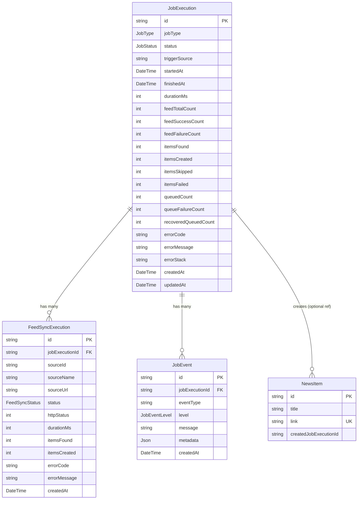

# 実装計画書: NexusFeed 実行履歴・障害追跡ログ基盤 (JobExecution / FeedSyncExecution / JobEvent)

## 1. 概要と背景

### 1.1 背景と課題
NexusFeed は Vercel Hobby プランで稼働しており、Vercel Runtime Logs の保存期間が約1時間と短いため、過去の Cron 実行結果（例: 2026-08-21, 2026-08-23 にニュースが保存されなかった事象）の事後調査が不可能です。

### 1.2 目的
Vercel Logs を置き換えるのではなく、
- **Vercel Logs**: 直近（1時間以内）の詳細デバッグ
- **Supabase/PostgreSQL**: 長期間（30日〜90日）保持するジョブ実行履歴・Feed別取得結果・障害イベント

という役割分担を確立し、過去の任意の実行について「なぜ保存されなかったのか」「どのFeedが失敗/タイムアウトしたのか」「キュー投入が何件失敗したのか」を後から確実に特定できる基盤を構築します。

---

## 2. アーキテクチャとデータモデル設計



### 2.1 ライフサイクルの原則（クラッシュ耐性）

1. **即時INSERT (`status = RUNNING`)**:
   Cron リクエスト受信直後に `JobExecution` レコードを作成。もし Vercel の 60 秒プラットフォーム強制終了が発生しても、`status = RUNNING` のまま残ることで「タイムアウトによる強制終了」を判定可能。
2. **インメモリ集約 & 一括保存 (`createMany`)**:
   Feed取得中のログはインメモリで集約し、フェーズ終了時に `FeedSyncExecution.createMany` で 1 クエリ一括保存（DBクエリ数最小化）。
3. **確実な終了ステータス更新 (`try-finally`)**:
   `SUCCESS` / `PARTIAL_SUCCESS` / `FAILED` / `TIMEOUT` を確実に UPDATE。

---

## 3. モジュール構成と責務

関心事の分離（Separation of Concerns）を徹底するため、ロギング専用サービス `lib/services/job-logger.ts` を新設します。

```text
app/api/cron/fetch-news/route.ts
    │
    ├── lib/services/job-logger.ts (JobExecution / FeedSyncExecution / JobEvent のCRUDカプセル化)
    │
    └── lib/news.ts
          ├── fetchRssFeeds (Feed別結果を収集して返却)
          ├── saveNewsToDb (createdJobExecutionId を NewsItem に付与)
          └── syncNews (全体のオーケストレーション & ログ連携)
```

---

## 4. ステップ別実装タスク

### Step 1: Prisma Schema の定義とマイグレーション
- `prisma/schema.prisma` に以下の Enum と Model を追加:
  - `enum JobType { RSS_SYNC, SWEEPER_ONLY, MANUAL_SYNC }`
  - `enum JobStatus { RUNNING, SUCCESS, PARTIAL_SUCCESS, FAILED, TIMEOUT }`
  - `enum FeedSyncStatus { SUCCESS, FAILED, TIMEOUT }`
  - `enum JobEventLevel { INFO, WARN, ERROR }`
  - `model JobExecution`
  - `model FeedSyncExecution`
  - `model JobEvent`
  - `NewsItem` に `createdJobExecutionId String?` と `@@index([createdJobExecutionId])` を追加。
- `npx prisma generate` を実行し、Prisma Client の型定義を更新。

### Step 2: ジョブログサービス `lib/services/job-logger.ts` の実装
以下の関数群をカプセル化して提供:
- `startJobExecution(jobType, triggerSource): Promise<string>`
- `completeJobExecution(id, summaryData): Promise<void>`
- `failJobExecution(id, error, summaryData): Promise<void>`
- `recordFeedSyncExecutions(jobExecutionId, feedResults): Promise<void>`
- `recordJobEvent(jobExecutionId, eventType, level, message, metadata): Promise<void>`
- `cleanupOldJobExecutions(retentionDays = 60): Promise<number>`（過去ログ削除）

### Step 3: `lib/news.ts` の改修
1. **Feed別結果の集計機能追加**:
   - `FeedFetchResult` 型（`sourceId`, `sourceName`, `sourceUrl`, `status`, `durationMs`, `itemsFound`, `error`）を定義。
   - `fetchRssFeeds()` が記事配列に加え、各Feedの実行統計（`feedResults`）を返却可能にする。
2. **`saveNewsToDb()` への `jobExecutionId` 伝播**:
   - `options` に `jobExecutionId?: string` を受け取り、`NewsItem` 作成データに `createdJobExecutionId` を設定。
3. **`syncNews()` の集計値拡張**:
   - `SyncNewsResult` に詳細集計（`itemsFound`, `itemsCreated`, `itemsSkipped`, `feedTotalCount`, `feedSuccessCount`, `feedFailureCount`, `queuedCount`, `queueFailureCount`）を含めて返却。

### Step 4: `app/api/cron/fetch-news/route.ts` の改修
1. リクエスト受信時に `startJobExecution` を呼び出し `jobExecutionId` を取得。
2. `syncNews` に `jobExecutionId` を渡して実行。
3. 実行結果およびエラーを集約し、`completeJobExecution` または `failJobExecution` を確実に呼び出し。
4. Feed統計・重要イベント（キュー送信失敗、タイムアウト警告等）を `FeedSyncExecution` / `JobEvent` に記録。

### Step 5: テストの作成と既存テストの拡充
1. `lib/services/__tests__/job-logger.test.ts`:
   - JobExecution 作成、完了更新、FeedSyncExecution 一括記録、JobEvent 記録の単体テスト。
2. `lib/__tests__/news.test.ts`:
   - `saveNewsToDb` が `createdJobExecutionId` を付与して保存することのテスト。
   - `fetchRssFeeds` が Feed単位の成否（成功・タイムアウト・エラー）を正しく集計することのテスト。
3. 全テストスイート（Vitest）の実行と通過確認。

---

## 5. 8/21・8/23 のような障害調査シミュレーション（検証方針）

実装完了後、以下のシナリオでデータが正しく蓄積されることを検証します。

```sql
-- 1. 直近のCron実行一覧とステータス・集計の確認
SELECT id, "jobType", status, "startedAt", "durationMs",
       "feedTotalCount", "feedSuccessCount", "feedFailureCount",
       "itemsFound", "itemsCreated", "itemsSkipped",
       "queuedCount", "queueFailureCount", "errorMessage"
FROM "JobExecution"
ORDER BY "startedAt" DESC
LIMIT 10;

-- 2. 特定の失敗/タイムアウトしたFeedの特定
SELECT "sourceName", "sourceUrl", status, "durationMs", "itemsFound", "errorMessage"
FROM "FeedSyncExecution"
WHERE "jobExecutionId" = 'TARGET_JOB_ID' AND status != 'SUCCESS';

-- 3. 重要障害イベントのタイムライン確認
SELECT "createdAt", "eventType", level, message, metadata
FROM "JobEvent"
WHERE "jobExecutionId" = 'TARGET_JOB_ID'
ORDER BY "createdAt" ASC;
```

---

## 6. リスク評価と対策

| リスク | 影響度 | 対策 |
| :--- | :--- | :--- |
| **ログ書き込みによるCron実行時間の延伸** | 低 | Feed統計・イベントは `createMany` でバッチ書き込みし、クエリ数を最小限（数回程度）に抑制 |
| **ログテーブルのデータ肥大化** | 中 | `JobExecution` 単位で 60 日経過したレコードを定期バッチで Cascade 削除するクリーンアップを実装 |
| **DB障害時にログ記録自体が失敗** | 低 | ログ書き込み処理は `try-catch` で安全にフォールバックし、本体のニュース収集を巻き添えで落とさない設計 |
